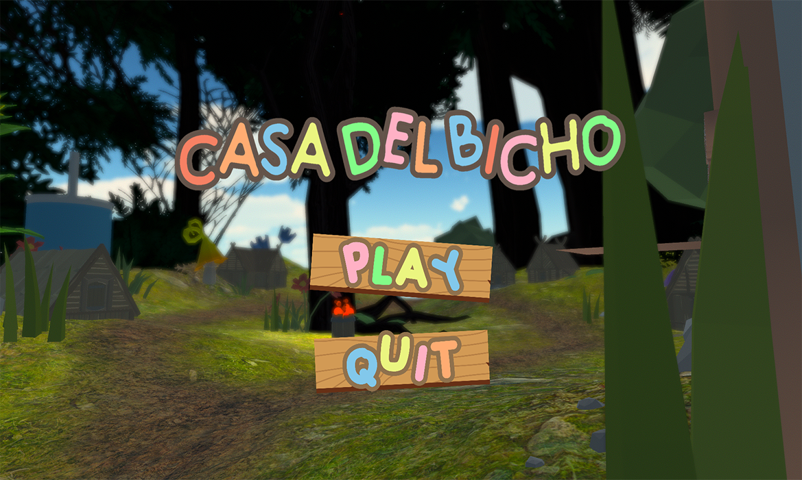
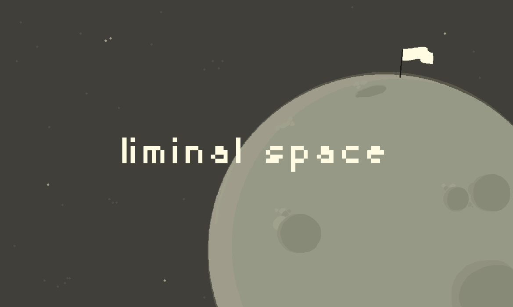
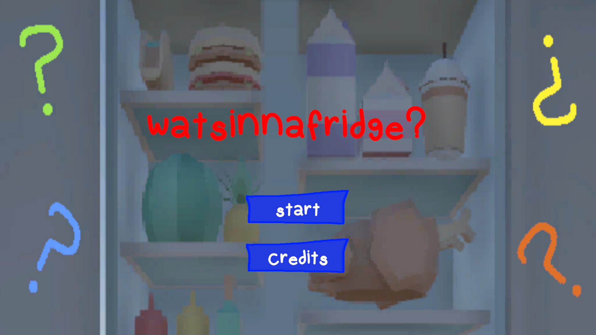
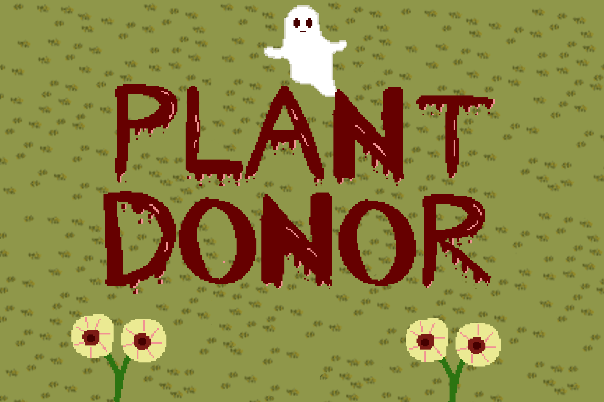

## Hi there! :D

I'm Orion, a computer engineer and game developer. Check out some of my projects below! 

### Personal Projects
- [My Portfolio](https://github.com/gobos12/gobos12.github.io)
- [Custom Win32 Game Engine](https://github.com/gobos12/ApolloEngine)

### Games

<picture>
    
    
    
    
</picture>

<!--
**gobos12/gobos12** is a ✨ _special_ ✨ repository because its `README.md` (this file) appears on your GitHub profile.

Here are some ideas to get you started:

- 🔭 I’m currently working on ...
- 🌱 I’m currently learning ...
- 👯 I’m looking to collaborate on ...
- 🤔 I’m looking for help with ...
- 💬 Ask me about ...
- 📫 How to reach me: ...
- 😄 Pronouns: ...
- ⚡ Fun fact: ...
-->
